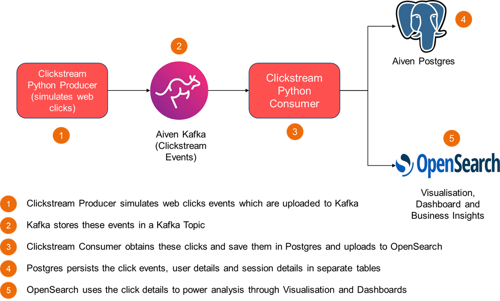

Real-Time Clickstream Analytics Pipeline

**Overview**

This project implements an end-to-end real-time pipeline for website
analytics using Aiven services. Terraform provisions Kafka (for event
streaming), Postgresql (for structured storage), and OpenSearch (for
analytics). A Python producer generates simulated clickstream data,
while a consumer processes events, calculates metrics (session duration,
conversions), and stores them in Postgresql. The OpenSearch integration
enables interactive dashboards showing traffic trends, user geography,
device usage, and conversion paths, providing actionable insights for
optimising web performance.

The solution uploaded consists of 3 folders that are explained below

-   Terraform Infrastructure provisioning (in **terraform** folder)

    -   The terraform project will create the Kafka, Postgres and
        OpenSearch services. The Terraform commands are called with the
        help of a simple shell script

    -   The shell script will also download the certificates required by
        Kafka for ingestion and consumption of the messages. Likewise,
        the shell script will create an .env file containing the
        connection details and credentials essential for the Python
        programs to connect to the Aiven services. The .env file and
        certs are then copied to the Clickstream Kafka Producer and
        Consumer folders.\
        *Due to the sensitive nature of this data, the .env file and
        certificate files have not been uploaded to GitHub*.

-   Clickstream Kafka Producer (in **clickstream\_producer** folder)

    -   This folder contains the code needed to simulate the web
        clickstream data that is sent to the Avien Kafka services

-   Clickstream Kafka Consumer (in **clickstream\_consumer** folder)

    -   This folder contains the code that listens for clickstream data
        from Kafka. The data is sent and saved in Avien Postgres once
        the data is obtained. At the same time, the data is also pushed
        to Avien OpenSearch, which is then rendered on a dashboard for
        analysis so that comprehensive business insights can be obtained

**Architecture**

A high-level view of the architecture is shown below

**Prerequisites**

-   Ubuntu Linux environment

-   Aiven account and API token

    -   This can be obtained from Aiven Console.

    -   The API token is needed by the Aiven CLI and Terraform
        application

-   Terraform 1.0+

-   Python 3.8+

-   OpenSSL for certificate management

-   Aiven CLI (avn)

**Setup Instructions**

1.  Clone the Repository

    -   **git clone
        https://github.com/your-repo/clickstream-analytics.git**

    -   **cd clickstream-analytics**

2.  Create a Virtual environment (Optional but recommended)

    -   This can be created with the following command

        -   **python -m venv .venv**

    -   Activate the virtual environment

        -   **source .venv/bin/activate**

    -   Create separate virtual folders for both clickstream producer
        and consumer as in the real world, the applications development
        would most likely be done by separate teams.

3.  Install Dependencies

    -   **pip install -r requirements.txt** -- This should be executed
        for both clickstream producer and consumer folders.

4.  Configure Environment

    -   Aiven CLI (avn) setup

        -   This can be installed with the help of **pip install
            aiven-client**

        -   **avn user login** -- This command is used to login into
            Aiven. This command will ask for a user name and password
            which is the token obtained above

    -   Create a file ***terraform.tfvars*** in the terraform folder.
        This will contain the token needed by Terraform to connect to
        Aiven

    -   The format of the should be as shown below:

        -   aiven\_api\_token = \<\<Aiven token here\>\>\"

        -   project\_name = \"\<\<Aiven Project Name\>\>\" ex.
            Aiven-demo

**Applications Execution**

1.  Terraform Execution

    -   Navigate to the Terraform folder and execute the
        ***avien-deploy.sh*** on the command prompt. This command will
        create a Kafka, Postgres and OpenSearch services instances in
        Aiven Cloud

    -   The shell script will also create an environment file contained
        the connection and credentials details needed by the Clickstream
        Producer and Consumer application. The .env file will
        automatically and SSL certificates to both folders. The
        certificates are located a separate folder

2.  Clickstream Producer Application

    -   Navigate to the clickstream producer folder on the
        command/terminal prompt

    -   Execute ***pip install -e .*** installs the current directory in
        editable mode, allowing changes to the code to take effect
        without reinstallation

    -   Execute to **python app/main.py** to simulate web clicks that
        will be sent to Kafka

    -   Note: The number of messages can be controlled through the
        variable NUMBER\_OF\_MESSAGES in the app/config.py folder. The
        default is 15 but if changed to -1 then the program will
        continuously run until explicitly stopped

3.  Clickstream Consumer Application

    -   Navigate to the clickstream consumer folder on the
        command/terminal prompt

    -   Execute ***pip install -e .*** installs the current directory in
        editable mode, allowing changes to the code to take effect
        without reinstallation

    -   Execute to **python app/main.py** to simulate web clicks that
        will be pulled from Kafka. The clicks are sent to Postgres and
        OpenSearch

**Accessing the data ingested into Postgres**

The postgres folder contains the outoput of 3 tables that were generated from our demo

    -   clickstream_events.csv - This file contains simulated user events when navigating the ecommerce platform

    -   sessions_metrics.csv - This file contains the aggregated details of a session

    -   clickstream_events.csv - This file contains the user session details

**Accessing the OpenSearch Dashboard**

1.  Navigate to OpenSearch Dashboards URL (provided in Aiven console)

2.  Log in with your credentials

3.  View the dashboard - Clickstream Analytics Dashboard

**Scaling Considerations**

1.  Kafka:

    -   Increase partitions for higher throughput

    -   Upgrade plan for more brokers

2.  PostgreSQL:

    -   Add read replicas for analytics queries

    -   Implement connection pooling

3.  OpenSearch:

    -   Adjust shard count based on data volume

    -   Configure index lifecycle management
